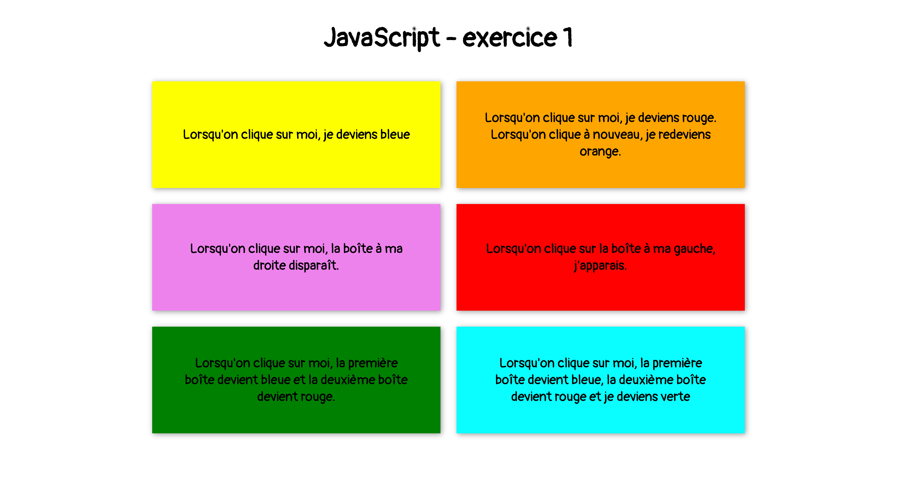

# Exercice JavaScript 1

A l'aide de JavaScript, faites en sorte que les actions décrites pour chaque bloc fonctionnent.

Vous n'avez pas besoin de modifier le HTML.

Écrivez votre code dans le fichier **js/main.js**

## Aperçu

